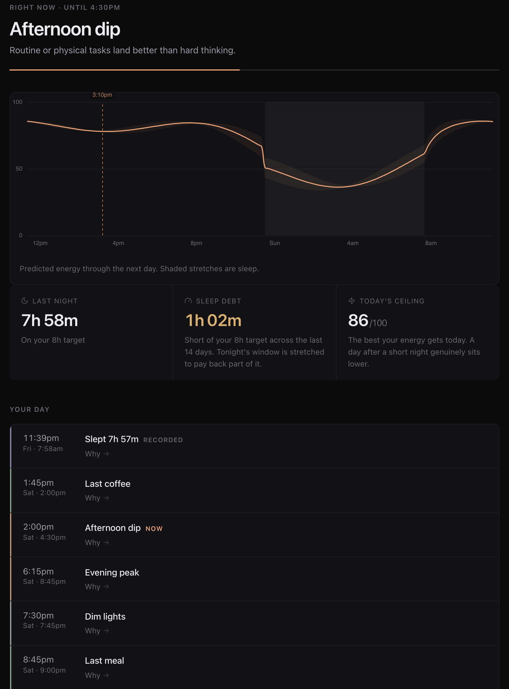

# Circa

**Turn a Fitbit into a working model of your body clock, and put the result on
your calendar.**

Circa reads your sleep, heart rate and step data through the Google Health API,
continuously estimates where your circadian phase actually sits, and writes the
day it implies to Google Calendar — when your focus peaks, when the afternoon
dip lands, when to get light, when to stop drinking coffee. It runs on a free
cloud VM for $0/month and needs nothing from you after setup.

*"Circa" means "approximately", which is the honest promise. See
[What this is not](#what-this-is-not).*



<sub>Screenshot of a demo instance running on synthetic data.</sub>

---

## Contents

- [Why](#why) · [How it works](#how-it-works) · [What this is not](#what-this-is-not)
- [Requirements](#requirements) · [Install](#install) · [Run it 24/7](#run-it-247)
- [The five calendars](#the-five-calendars) · [The web app](#the-web-app)
- [Commands](#commands) · [Configuration](#configuration)
- [Accuracy and validation](#accuracy-and-validation) · [Privacy](#privacy)

---

## Why

Your alertness across a day is not a straight line down from waking. It is a
circadian rhythm with a morning peak, an afternoon dip and an evening second
wind, riding on top of sleep pressure that builds the longer you are awake. If
you know where your own rhythm sits, you can put hard work in the peaks, stop
fighting the dip, and use light at the times that actually move your clock.

Commercial apps do this well and charge a subscription. Circa does it from data
you already produce, on hardware you already own, for nothing — and shows its
working, including how uncertain it is.

## How it works

```
sleep timing ─┐
              ├─ von Mises observations ─┐
HR (de-masked)┘                          │
                                         ├─ bootstrap particle filter ─→ p(DLMO)
steps → light ensemble ──→ St. Hilaire ──┘         (per-particle τ and offsets)
        (pvlib clear-sky ceiling)   oscillator
                                                            │
                              two-process homeostat ────────┤
                              + circadian drive             ├─→ alertness ± band
                              + sleep inertia ──────────────┘
                                                            │
                                          confidence tiers ─┴─→ calendar blocks
```

1. **Two independent phase signals.** Your sleep midpoint over the last few
   weeks, weighted so alarm-forced mornings count for less than free ones. And
   your heart-rate rhythm, with the effect of activity and sleep regressed out
   first, so what is left is the endogenous part.
2. **Light, inferred.** No wrist wearable worth using has a usable light sensor,
   so step counts stand in for light exposure — a method that beat *measured*
   wrist light in published comparisons. The estimate is clamped to the real
   clear-sky irradiance at your latitude, and an ensemble of plausible light
   histories is sampled from it so that uncertainty is carried explicitly rather
   than assumed away.
3. **A real oscillator.** Those light histories drive the St. Hilaire limit-cycle
   model through a bootstrap particle filter. Each particle carries its own
   intrinsic day length, so the output is a distribution over your melatonin
   onset, not a point guess.
4. **Alertness is computed separately.** Circadian drive, sleep pressure and
   sleep inertia combine into an energy curve, per particle, so phase
   uncertainty propagates into a visible confidence band.
5. **Blocks, gated by confidence.** Peaks and dips become calendar events with
   their uncertainty in the title. Detail unlocks as nights accumulate, and is
   withdrawn again after travel, illness or an all-nighter.

## What this is not

Circa produces a **calibrated model of your circadian state, not a measurement
of it.** Consumer wearables have no ambient light sensor and expose skin
temperature only as one number per night, so the laboratory phase markers — DLMO,
core-temperature minimum — are never directly observed.

Realistic accuracy once mature is roughly **±45–60 minutes**, with an unknown
personal sleep→DLMO offset as a systematic error floor that more nights cannot
remove. Published wearable studies report ~0.6–1.0 h MAE against real DLMO in
regular sleepers, degrading to 2.5–2.8 h under circadian misalignment.

Every output carries its uncertainty. `Morning peak (±40m)`, never
`Morning peak: 10:17 AM`.

**It is not a medical device** and gives no medical advice. If you have a sleep
disorder, see a clinician.

## Requirements

- A **Fitbit** that syncs to the Google Health app — Circa was built against a
  Fitbit Air, and works with anything exposing sleep, heart rate and steps.
- A **Google account** and a free Google Cloud project for the OAuth client.
- **Python 3.12+** and [`uv`](https://docs.astral.sh/uv/).
- Somewhere to run it. A laptop works; a free VM works better — see
  [Run it 24/7](#run-it-247).

## Install

```bash
git clone https://github.com/kmandve/Circa.git
cd Circa
uv venv --python 3.12
uv pip install -e ".[science,dev]"   # [science] is the model; without it nothing is estimated
cp .env.example .env          # fill in: OAuth client, timezone, coordinates
```

Now follow **[`docs/SETUP.md`](docs/SETUP.md)** for the Google Cloud side. It is
about twenty minutes of clicking and it flags the one step everybody gets wrong
(leaving the consent screen in "Testing", which silently kills your refresh
token after seven days).

Then:

```bash
uv run circa init            # create the database
uv run circa auth            # authorise against Google
uv run circa sync --force    # first collection pass, backfills 90 days
uv run circa doctor          # check config, credentials, coverage
uv run circa run             # estimate phase, write the calendars
uv run circa serve           # web app + background poller
```

`circa serve` is the only long-running command; it polls every 15 minutes and
re-runs the model as data arrives.

### The first week

Circa is deliberately humble before it has evidence. Under 7 nights you get wide
sleep and light blocks only, labelled provisional. Focus blocks appear at 7
nights, body blocks at 14, full detail at 30 — and the tier can be knocked back
down by poor data coverage, channels that disagree, or an unusual day.

| Nights | What appears |
|---|---|
| 0–6 | Sleep and light, wide, marked provisional |
| 7–13 | Focus windows — morning peak, afternoon dip, evening peak |
| 14–29 | Body — workout window, caffeine cutoff, last meal |
| 30+ | Full detail; personal offsets override the population prior |

## Run it 24/7

The collector only makes outbound calls, so it needs no public endpoint, no TLS
certificate and no inbound firewall rule. A **GCP e2-micro Always Free** VM runs
it for $0/month with room to spare.

**[`deploy/README.md`](deploy/README.md)** has the whole procedure: the exact
`gcloud` invocation (the console defaults to a billed disk type and a billed
network tier — both are easy to trip over), a provisioning script that sets up a
service user, swap, a hardened systemd unit and log rotation, and how to
authorise and reach the dashboard over an SSH tunnel.

Being offline is safe. Data lives in Google's cloud and is fetched by watermark,
so a collector down for three days backfills three days on restart.

## The five calendars

Each is a separate Google Calendar, so you can toggle any of them independently
from the sidebar on any device, and Circa paints each one its own muted colour.

| Calendar | Contents |
|---|---|
| `Circa · Focus` | Morning peak, afternoon dip, evening peak |
| `Circa · Sleep` | Melatonin peak, wind-down, your sleep window, nights as recorded |
| `Circa · Light` | Bright-light and dim-light windows — the strongest lever you have on your clock |
| `Circa · Body` | Workout window, caffeine cutoff, last meal |
| `Circa · Debug` | Phase estimate, credible interval, model version (off by default) |

Every event explains itself. Open one and it tells you what the block is, why it
sits where it does, and how confident the model is.

Circa requests `calendar.app.created`, **not** blanket calendar access: it can
only manage calendars it created itself and physically cannot modify or delete a
real appointment. It also reads your calendar's free/busy — times only, never
titles — to work out which mornings you woke to an alarm.

## The web app

`circa serve` puts a small dashboard on `127.0.0.1:8720`.

- **Today** — what is happening now, your energy curve with a live clock marker,
  last night, sleep debt, and the day ahead.
- **Trends** — an actogram of when you slept with alarm-forced mornings drawn
  hollow, sleep duration, resting heart rate, and data coverage.
- **Details** — where the uncertainty comes from, what each signal says, how
  much the estimate moves night to night, and collection status.
- **Settings** — every knob, from target sleep to caffeine half-life. You should
  never need to edit code.

It binds to localhost and has no authentication, because it holds detailed sleep
and cardiovascular data. Reach it through an SSH tunnel, not an open port.

## Commands

| Command | Purpose |
|---|---|
| `circa init` | Create the database |
| `circa auth` | Authorise against Google |
| `circa probe` | Dump real API response shapes — check the docs against reality |
| `circa sync` | Run one collection pass |
| `circa status` | Per-data-type sync state |
| `circa doctor` | Config, credentials, freshness, coverage, confidence tier |
| `circa retention` | Prune aged-out raw payloads and 5-second samples |
| `circa run` | Estimate phase, build the alertness curve, push calendar blocks |
| `circa backtest` | Held-out-day ablation ladder |
| `circa calendars` | List (or delete) the calendars Circa manages |
| `circa serve` | Web app + background poller |

## Configuration

Secrets and machine-level settings live in `.env` (see
[`.env.example`](.env.example)); everything behavioural lives in the Settings
page and is stored in the database.

`CIRCA_LATITUDE` / `CIRCA_LONGITUDE` are a **static setting, not location
tracking** — they exist so the light proxy has a physical daylight ceiling. Your
nearest city is precise enough, and Circa never reads a device location.

## Accuracy and validation

There is no ground truth on a wrist, so Circa validates against behaviour that
is genuinely informative about phase and costs you nothing: how long you take to
fall asleep relative to the predicted sleep gate, when you wake on mornings your
calendar is clear, where night-time wakefulness clusters, and when spontaneous
inactivity lands relative to the predicted dip.

`circa backtest` runs a **held-out-day** ablation ladder — never a random split,
which leaks near-identical within-day state into both sides and makes a bad model
look excellent. It reports circular MAE, RMSE, signed bias, P30/P60/P90 and
credible-interval coverage, and it exists to let you delete any channel that does
not earn its place.

The test suite is ~900 tests, most of them written against bugs found in
production rather than imagined in advance.

## Privacy

- **Your data stays yours.** Everything is a single SQLite file on a machine you
  control. Nothing is sent anywhere except back to your own Google Calendar.
- **No measured health values reach the calendar.** Calendar events say
  "Morning peak", never "HRV 41 ms, RHR 57" — a calendar is a surface other
  people can end up seeing. This is enforced by a test.
- **Refresh tokens are encrypted at rest** with a Fernet key held outside the
  database.
- **Minimal scopes.** Health data is read-only. Calendar access is limited to
  calendars Circa created.

## Licence

MIT. Dependencies are MIT / BSD-3 / Apache-2.0 only; GPL and AGPL scientific
packages (`pyActigraphy`, `circStudio`, `FIPS`) are deliberately excluded so the
licence stays clean.

## Acknowledgements

Built on published science, in particular St. Hilaire et al. (2007) for the
limit-cycle oscillator with non-photic drive, Åkerstedt & Folkard's three-process
model of alertness, Huang et al. (2021) for scaled step counts as a light proxy,
and Kim et al. (2023) for activity-corrected heart-rate phase. The
[`circadian`](https://pypi.org/project/circadian/) package does the oscillator
integration.
